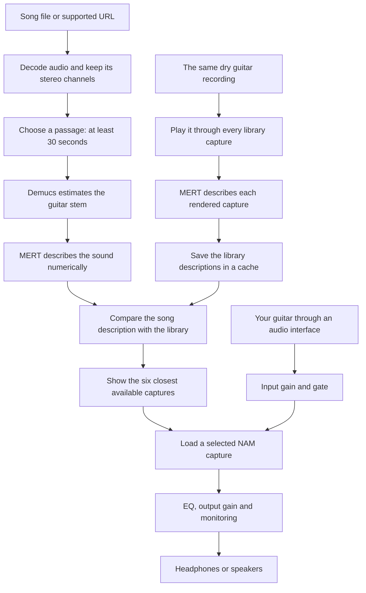

# How ToneHound works

For the September 2026 Library, ten-second EQ matching, pedals and automatic
solo/rhythm controls, also read [the studio guide](STUDIO_FEATURES.md). The
40-capture counts below describe the original regression library, not a limit;
the current matcher includes additional downloaded supported captures.

ToneHound helps you find a playable guitar amp capture that sounds similar to a
guitar passage in a recording. You supply a song and select a passage. ToneHound
extracts an estimate of its guitar sound, compares it with a library of amp
captures, and lets you play your own guitar through the closest candidates.

The application has two jobs: analysing a reference recording, and processing
your guitar as you play. Analysis can take time. Guitar processing must respond
continuously, so these jobs run separately.

This guide describes the native Windows standalone application and VST3 as
implemented through **15 September 2026**. Historical stereo regression results
below retain their original test conditions.

## 1. The whole journey



## 2. Importing a song

In the reference panel, **FILE** opens an MP3 or WAV, and dragging a supported
file onto the editor does the same thing. **LINK** passes a URL to yt-dlp, which
obtains audio from a supported site. Link availability depends on the source
site and the installed downloader. A URL is downloaded for local processing;
it is not streamed directly through the amp.

The decoder first tries libsndfile, an audio-file reader. If that cannot read
the format, FFmpeg handles the conversion. This covers formats such as the
WebM audio commonly returned by a YouTube download.

The imported working audio is converted to **48,000 samples per second** and
stored as floating-point WAV. Resampling changes the number of measurements
per second while preserving the intended playback speed and pitch. Left and
right remain separate. One shared level adjustment is applied to the channels,
so their relative balance is retained. A genuinely mono file is shown as mono.

ToneHound stores a decoded copy for its waveform and reference player. It does
not overwrite your original file. The reference label shows whether the newly
imported source is stereo or mono.

## 3. Choosing the part that matters

The initial selection is **40 seconds**, or the whole track if it is between
30 and 40 seconds long. The application enforces a **30-second minimum** and
keeps the selection within the track.

You can drag either waveform handle, drag the selected region, or enter start
and end times. For example, `0:22` to `1:00` selects 38 seconds. **Play selection**
previews that passage, and **Loop** repeats it while you play.

Choose a passage where the guitar sound you want is present consistently.
A selection containing a clean introduction followed by a distorted chorus
asks the matcher to describe both sounds together. The crop editor selects
the analysis and playback region; it does not splice, rearrange or export an
edited song.

## 4. Demucs: separating the instruments

A commercial recording contains guitars, bass, drums, vocals and other sounds.
Comparing the whole recording directly with a solo amp would also compare its
drums and singer. ToneHound therefore uses **htdemucs_6s**, a Demucs model that
estimates six separate tracks, called *stems*: guitar, bass, drums, vocals,
piano and other. Its guitar and piano separation is experimental according to
the [Demucs project documentation](https://github.com/facebookresearch/demucs).

Demucs receives the selected stereo passage. Stereo matters because instruments
can occupy different positions on the left and right, and two guitar takes can
interact differently when combined. Preserving those channels gives the
separator more of the information contained in the recording.

ToneHound asks for the guitar stem. If its energy is below the configured
near-silence threshold, it tries the **other** stem. If neither is usable, it
stops matching and asks for a passage with clearer guitar. This is an energy check, not
a guarantee that an audible stem contains only guitar. Separation can leave
drums or bass behind, miss part of a guitar, or introduce artefacts.

The selected stem keeps its channels. The UI reports which stem was used, and
the analysis job saves the selected stem locally for diagnosis. The ordinary
reference Play button continues to play the imported recording.

## 5. MERT: describing the sound

MERT converts audio into a list of numbers called an **embedding**. Think of it
as a description of the sound that a computer can compare with other
descriptions. It does not return an amp brand or search a database of song
credits. Background on this family of models is available in the
[MERT model card](https://huggingface.co/m-a-p/MERT-v1-330M).

ToneHound currently uses the
[MERT checkpoint fine-tuned on GTZAN](https://huggingface.co/dzur658/MERT-v1-330M-finetuned-gtzan).
That fine-tuning concerns musical genre. The checkpoint was not trained
specifically to identify NAM captures or the equipment used in a recording.
ToneHound uses intermediate encoder layers, selected through the project's own
experiments, as a starting point for tone comparison.

For each channel containing meaningful audio, ToneHound:

1. Resamples an analysis copy to MERT's 24 kHz input rate.
2. Adjusts its level so a louder recording does not win just because it is loud.
3. Analyses five-second windows. For ordinary selections, complete windows are
   used and a shorter final remainder is omitted.
4. Collects the representations from layers 8, 9, 10 and 11.
5. Averages the window descriptions and combines the layers into a
   4,096-number vector.

For stereo, channel descriptions are averaged before the final combined vector
is normalised. The waveforms are **not** added together before MERT. This avoids
losing a wide or opposite-polarity guitar through waveform cancellation.
Channels with negligible energy are excluded. This processing only affects
the analysis copy; the reference player retains the imported stereo audio.

## 6. Giving every amp the same audition

A `.nam` file is a **Neural Amp Modeler capture**: a learned model of an audio
device or signal chain at particular settings. Depending on how it was made,
it may contain an amp alone, or an amp, cabinet, microphone and other processing.

To compare captures fairly, ToneHound sends the **same dry guitar performance**
through each candidate. A dry recording, or **DI**, contains the guitar signal
before an amp colours it. The current index uses the first 15 seconds of the
project's `assets/user_di/Djent DI.wav` when available. A configured personal DI
can replace it, and a deterministic generated probe supports a fresh checkout.

An optional learned comparison now builds on these base descriptions using
multiple DI recordings. Djent and Funk train it, Thall selects its settings, and
Baritone tests it. Controlled remixes with backing stems from `song_train` teach
the comparison about MP3 and htdemucs separation damage. MERT and htdemucs weights
remain frozen. See [the training guide](MULTI_DI_TRAINING.md) for the complete
procedure, split boundaries and measured results.

Each rendered result goes through the same MERT description process as a query.
These descriptions are saved in an index. A cached index makes subsequent
searches much faster: ToneHound does not need to play and describe every amp again
for each song.

The persistent catalogue tracks capture contents, DI provenance and embedding
settings. New or changed captures are processed as needed. A portable descriptor
pack keeps its original probe descriptions when imported by another user;
changing that user's DI does not trigger a download of its entire collection.
An explicit rebuild regenerates descriptors with the current probe. Changing
the embedding configuration requires compatible descriptors. Preserving reference
stereo does not require re-rendering the existing mono capture library.

The local library has **51 captures: 42 indexed TONE3000 captures and nine
additional community captures labelled as cabinet-included full rigs**. Forty was
the initial collection, not a limit; the older optional development corpus is
currently absent. The app now supports larger portable descriptor collections.
For 500 current-format captures, the numerical descriptions occupy about
7.8 MiB before metadata, without storing 500 NAMs. This update tested 500
synthetic descriptors; it did not curate or train on 500 real captures.

New managed NAM downloads have a 32 MiB working-cache target. Active, recent
and unindexed files are protected; pre-existing and local imports are preserved.
Eviction removes the playable file, while its descriptor remains searchable.
Choosing an evicted capture downloads it again, verifies its identity and hash,
and then loads it. Offline use requires that selected NAM to remain cached.
See [CATALOGUE_AND_MERT.md](CATALOGUE_AND_MERT.md) for the complete storage model
and the distinction between adding captures and training MERT.

## 7. Ranking and displaying the results

ToneHound subtracts the library's average description and compares the direction
of the resulting vectors, using a calculation called **cosine similarity**.
Closer directions receive higher similarity scores. The native UI returns
the six highest-ranked available candidates.

Similarity is a comparison within this library. It is not a probability that
the band used that amp, and it is not a percentage of tonal accuracy. A small
or unsuitable library will still have a first-place result.

The ranking is based on rendered audio. Amp names, artist names and the title
of the imported song are not used to force clean or distorted results. The
stereo fix described below does not add a Metallica-specific rule.

Each linked capture retains its TONE3000 Tone ID, Model ID and source page.
ToneHound downloads the photograph supplied on that page and displays the whole
image at its original proportions. Dark space around a portrait or square
photo is expected when it sits inside the wider amp panel. There is no
centre-cropping or stretching to make every photo fill the panel. Local files
without linked artwork use a placeholder.

The top match downloads if needed and loads automatically. Click other results
to compare their actual NAM captures using your guitar.

## 8. Playing your guitar through ToneHound

The live signal path is:

```text
Guitar → audio interface → selected input channel
       → input gain and noise gate → Pitch → Screamer → NAM capture
       → Bass / Mid / Treble → eight-band match EQ → Delay → Reverb
       → output gain and monitoring
       → left and right outputs

Imported reference → crop playback / loop → its original left and right
                                            ↓
                              mixed with the live guitar output
```

Your guitar normally arrives as one input channel. ToneHound processes that mono
signal; optional delay and reverb create stereo output. That is separate from the reference song,
whose left and right channels remain distinct. Changing the capture changes
your guitar sound; it does not run the backing track through that capture.

**Input** changes the level entering the capture and can therefore change how
hard it distorts. **Gate** suppresses quiet input noise. **Bass, Mid and Treble**
are EQ after the capture; they do not reconstruct or turn the original amp's
physical knobs. **Output** sets the processed guitar level. Bypass skips pitch,
pedals, the capture and EQ while retaining input conditioning and monitoring.

**Pitch** transposes the guitar −12 to +12 semitones. Live mode adds 40 ms of
processing delay; it can smear closely spaced low notes. Studio mode gives
clearer chords with 192 ms delay, intended for recorded guitar. **Pitch settings**
adds wet/dry harmony, fine tuning and pick-attack preservation. Zero semitones
and zero cents adds no pitch latency. Interface buffers and any amp resampling
are additional.

After matching a passage, **EQ match** records ten seconds of your guitar after
the amp and tone controls, before delay/reverb, reference playback and output
gain. It compares average frequency balance with the separated reference and
fits eight bands. Its automatic correction is limited to about ±6 dB overall;
the user can then move each band up to ±12 dB. Bands are 63, 125, 250, 500 Hz,
1, 2, 4 and 8 kHz. Switching amps resets these bands and Bass/Mid/Treble to zero.
Silence and insufficient frequency coverage are rejected. This changes EQ,
not the NAM model or MERT's training.

The graphical **Pedals** tab provides Screamer, stereo tempo delay and reverb.
Selecting Solo applies an editable delay/reverb preset after matching, using
the passage's estimated BPM. Rhythm switches delay/reverb off. These are
starting settings, not measurements of the recording's exact effects.

Captures contain fixed recorded settings. ToneHound neither trains a new NAM
from the song nor adds a cabinet automatically to an amp-only capture. Choose
a suitable full-rig capture when you want its cabinet and microphone sound
included.

In the **standalone app**, open I/O, select your interface and driver, choose
the matching Input 1 or Input 2, and enable monitoring. A smaller audio buffer
reduces delay but gives the computer less processing time per callback. The
local interface was previously tested at 48 kHz with a 256-sample ASIO buffer.

In the **VST3**, your DAW supplies audio and controls the device, buffer, sample
rate and track routing. Insert ToneHound on a guitar track and enable the DAW's
track monitoring. The reference player is an audition transport and does not
follow the DAW timeline.

## 9. Why the older Metallica examples went wrong

The investigation found a channel-handling bug **in ToneHound's import and
separation plumbing**. The old import code averaged left and right into mono.
The FFmpeg fallback also explicitly requested one channel. Demucs therefore
received an already collapsed recording, and the saved reference player could
only play that mono version.

The updated path preserves channels when decoding, caching, cropping and
separating. MERT then describes the channels independently. Stereo playback
has also been checked through the native audio processor.

Controlled comparisons used the same 40-capture index, checkpoint, layers and
crop, with the same random seed for both separation runs:

| Recording and selection | Old mono-first top three | Corrected stereo top three |
| --- | --- | --- |
| Master of Puppets (Remastered), supplied link, 0:22–1:00 | Ampeg SVT; Roland JC120; Fender Super Reverb | Marshall JCM800 SC20; Peavey 5150; Blackstar Series One OD1 |
| Master of Puppets, supplied lyrics-video link, 0:22–1:00 | Ampeg SVT; Roland JC120; Fender Super Reverb | Marshall JCM800 SC20; Blackstar Series One OD1; Peavey 5150 |
| For Whom the Bell Tolls (Remastered), earlier cached link, 1:00–1:38 | Ampeg SVT; Roland JC120; Fender Super Reverb | Blackstar Series One OD1; two Peavey 5150 captures |
| Periphery — Marigold guitar playthrough, control, 1:00–1:38 | Blackstar Series One OD1; two Peavey 5150 captures | Same three captures in the same order |

Preserving stereo through Demucs was sufficient to correct the clean/bass
shortlist in both supplied Master of Puppets passages, even when the separated
guitar was subsequently folded to mono for the diagnostic comparison.
This isolates the pre-separation channel loss as the main cause in those tests.

These are measured improvements on specific excerpts. They do not establish
which equipment was used on the original records, or prove that all older or
remastered songs now match correctly. The second supplied video's title does
not establish which release or mastering it contains.

**The actual amp and the closest library capture are different questions.**
Master of Puppets is associated with the Mesa/Boogie Mark IIC+, as described in
[MESA's account of John Petrucci's influences](https://legacy.mesaboogie.com/amplitudes/2016/June/John-Petrucci-and-the-Story-Behind-the-JP-2C.html).
The initial 40-capture library had no capture labelled Mark IIC+. The JCM800
result therefore demonstrates a change toward a distorted sound in that small
library; it is not a correct identification of the album's amp. A Mark IIC+
capture must first be downloaded and indexed before it can compete. Even then,
its settings, cabinet, microphone and the mix may change its ranking. There is
no Metallica title lookup or forced Mark IIC+ ranking in the matching code.

On 10 September 2026, two creator-labelled Mark IIC+ amp/cab captures were
downloaded through TONE3000 (Tone IDs 51344 and 47644) and indexed, bringing the
local library to 42. For the remastered 0:22–1:00 passage, the unchanged matcher
ranked JCM800 first (0.7929) and the Mark IIC+ full rig second (0.7861). These
are similarity scores, not probabilities of identifying the actual amp. The
better shortlist demonstrates the effect of library coverage; it does not
establish reliable amp identification.

**After updating, import previously loaded songs again from their original
file or URL and run matching again.** Old cached mono WAVs cannot recover the
lost channels. New imports use a different media cache key, so they do not
reuse those old decoded copies. There is no need to delete your downloaded
originals or rebuild the capture index.

The reproducible inputs, scores and capture IDs are recorded in
[stereo_matching_regression.json](stereo_matching_regression.json).

## 10. What runs where, and what gets saved

The interface is native **JUCE C++**, delivered as a Windows application and
a VST3 bundle. NAM guitar processing runs in C++ on the CPU inside the audio
callback. Downloading, separation, MERT and index preparation run in a separate
Python process, communicating through local request, progress and result files.
The native application does not require a browser or a local web server.

On this machine, Demucs and MERT use the NVIDIA GPU when available. Offline
NAM indexing can also use CUDA for supported models, with CPU fallback. Live
guitar processing stays in the native audio path. Closing or cancelling an
instance's analysis terminates its own worker process tree.

| Location | Purpose |
| --- | --- |
| `.cache/downloads` | Original audio downloaded from song URLs |
| `.cache/native/media` | Decoded reference WAVs and saved selected stems; identical separated audio reuses one verified stereo WAV, keyed by its samples, shape and sample rate |
| `.cache/native/artwork` | TONE3000 photographs and attribution metadata |
| `.cache/native/jobs` | Analysis requests, progress, responses and logs |
| `.cache/tone3000/profiles` | Downloaded NAM capture files |
| `.cache/tone3000/catalogue.sqlite` | Persistent searchable descriptors, identities and hashes; independent of evicted NAM files |
| `.cache/tone3000/leases` | Expiring protection for models selected in running instances |
| `.cache/uvr_models` | Separation model files |
| `.cache/tone_index_*.npz` | Legacy reusable capture descriptions, also reused when populating the catalogue |
| `%APPDATA%/ToneHound` | Standalone device configuration and session state |

The VST3 stores parameters, selected capture, reference path and crop in the
DAW's plugin state. Audio and model assets remain external files. Inference is
local; this pipeline does not upload the reference recording for AI analysis.
Network requests are used for supported URL downloads, TONE3000 assets and
authentication, and model downloads when necessary.

The current package depends on this project's Python environment, weights,
captures and cache. It is a working local development distribution, not yet
a self-contained installer for a second computer.

## 11. Getting useful results and understanding the limits

Start with a consistent guitar passage, check the reported separation source,
then play through several candidates at comparable output levels. Adjust input
gain for your guitar and use the post-capture EQ for a practical starting tone.

Your pickups, tuning, strings, playing, cabinet content and microphone capture
can all change the result. A record may also contain multiple guitar takes,
layered amps, effects, mix EQ and mastering. One mono NAM capture cannot
recreate every part of that production.

The current MERT-based retrieval remains experimental. The library size and
the quality of the separated guitar limit the answer. ToneHound's useful output
is a shortlist you can actually play and assess by ear.

For implementation work, the main files are `engine/tonehound/audioio.py`,
`ingest.py`, `separate.py`, `embed.py`, `tone_index.py`, `pipeline.py` and
`native_bridge.py`, plus `native/Source/PluginProcessor.cpp` and
`PluginEditor.cpp`. Build and launch instructions are in `native/README.md`
in the source project, or `README.md` beside this guide in the packaged build.
