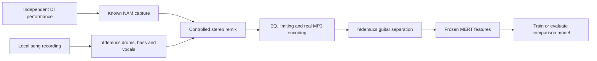

# How ToneHound learns from different performances

ToneHound now fits a small comparison model on top of **frozen MERT features**.
The MERT and htdemucs neural-network weights are unchanged. The new model learns
which features remain useful when the same capture plays different riffs,
guitars, input levels and processed recordings.

A NAM file is an amp simulation, not a recording. To teach the comparison, we
play a clean DI recording through a known capture. The capture's content hash is
the correct answer for that example. Song names never supply amp labels.

## The four DI recordings

| Purpose | Recordings | Allowed use |
| --- | --- | --- |
| Training | Djent DI, Funk DI | Fit the projection and capture reference vectors |
| Validation | Thall DI | Select the projection strength |
| Final test | Baritone DI | Evaluate the already selected model |

Each take contributes an eight-second excerpt starting at 0 seconds, and another
at 10 seconds. The second uses 6 dB less input gain. The raw DI level is preserved
before the NAM: normalising every DI to a loud peak would change how hard the amp
is driven. After rendering, MERT applies its usual analysis-level normalisation.
Clean renders and modest EQ/limiting variants are included.

The whole recording stays in one split. Renaming a file or changing its container
does not let identical decoded samples enter both training and testing. This is
still only four recordings; excerpts and processing variants are not independent
players, guitars or studio sessions.

## Training through htdemucs with `song_train`

The seven local song recordings provide realistic accompaniment. First,
htdemucs_6s extracts drums, bass and vocals from an eight-second excerpt at 0:40.
The original guitar, piano and other stems are excluded. Some source-separation
leakage can still remain in the accompaniment.



Every capture is tested against the same accompaniment choices. That prevents
the backing song from identifying the correct capture. The known NAM-rendered
guitar is mixed at a fixed RMS relationship to the accompaniment. The remix is
encoded to MP3, decoded and passed through the same stereo-preserving
htdemucs_6s path as ordinary matching. A fallback to `other` is recorded; a raw
mix is never accepted as the recovered guitar.
If neither guitar nor `other` is usable, the example is excluded from fitting
but retained as a failed match in validation/test denominators, with reciprocal
rank zero. Failed extraction therefore cannot artificially improve recall.

| Purpose | Backing songs |
| --- | --- |
| Training | D'Masiv — Cinta Ini Membunuhku; Loathe — Fangs; Periphery — Garden In The Bones; Periphery — The Bad Thing |
| Validation | Karmanjakah — Diamond train |
| Final test | Spiritbox — Tsunami Sea; Panah Asmara karaoke |

Both Periphery recordings stay together. Validation and test backing songs are
absent from training, as are their assigned DI recordings. The existing filename
rules assign dataset splits only; matching never ranks an amp using a song title.

This trains the **comparison after separation**. It does not retrain htdemucs to
separate better, and it does not establish which equipment the original artists
used. That would require independently confirmed amp/cabinet information and
preferably the original guitar stems or controlled recordings of those rigs.

## What gets trained

The input is MERT's 4,096-value description from layers 8–11. Training fits a
64-dimensional basis, estimates how each capture's features vary across
performances, and learns a regularised projection that reduces those unstable
directions. This is supervised metric learning using a closed-form covariance
fit, not a gradient update of the MERT backbone.

Five strengths are considered: identity, 0.1, 1, 10 and 100. Validation chooses
top-five retrieval first, then mean reciprocal rank. In the separation run,
selection uses only the separated validation examples. The test is inspected
after the choice, never used to tune those strengths.

The candidate must pass a fixed non-regression check before it replaces the
active model. Separation training is also compared with the previously active
model on the same separated test queries, with at most a two-percentage-point
loss in clean top-five retrieval. A failing candidate stays available for review
without replacing the app's current model.

During normal matching, the query and capture references pass through the same
projection. A new capture without multi-DI features can still use its base MERT
descriptor; the response reports how many captures have training coverage.
Changed NAM contents or an incompatible encoder signature cannot silently reuse
another model's training vector. Missing or invalid optional model files fall
back to ordinary MERT retrieval.

## The initial controlled result

Before adding the song-separation examples, the 51-capture test used the unseen
Baritone recording: 102 clean queries and 102 EQ/limiting variants.

| Comparison | Top one | Top five | Mean reciprocal rank |
| --- | ---: | ---: | ---: |
| One DI reference | 48.0% | 88.2% | 0.648 |
| Multi-DI average without learning | 46.6% | 80.4% | 0.615 |
| Learned multi-DI comparison | 71.1% | 95.1% | 0.814 |

These are controlled exact-capture retrieval results within this particular
library. They are not commercial-song amp-identification accuracy, and cannot
be compared directly with the older 34-capture Demucs benchmark. Capture units,
families and recording sessions are not held out in this test. Blind listening
and a larger independently labelled corpus remain necessary.

## Completed song-separation result

The 408 remix comparisons produced 403 guitar stems, four `other` fallbacks and
one unusable training example. All 102 final test remixes remain in the reported
denominator. The test uses Baritone DI with the two held-out backing songs.

| Comparison | Separated top one | Separated top five | MRR |
| --- | ---: | ---: | ---: |
| Controlled single-DI baseline (8-second reference) | 21.6% | 42.2% | 0.329 |
| Previously deployed single-DI descriptors (15-second reference) | 23.5% | 43.1% | 0.341 |
| **Active learned multi-DI model** | **33.3%** | **50.0%** | **0.425** |
| Candidate additionally trained on separated remixes | 33.3% | 49.0% | 0.415 |

The separation candidate also reduced clean top-five retrieval from 95.1% to
92.2%. It failed the non-regression gate and **was not activated**. Its fitted
weights and report are retained for review. This is a completed negative
experiment, not a claim that more training examples always improve accuracy.
The active multi-DI model remains an improvement over the single-DI baseline
on these controlled remixes, but half the correct captures are still outside
the top five. Its test has only one held-out DI and two backing recordings.

The reproducible metrics and split provenance are in
[retrieval_evaluation.json](retrieval_evaluation.json). The full run, including
each remix's selected stem, is in `.cache/tone_learning/report.json`. The active
artifact is `.cache/tone_learning/active.npz` (1,779,647 bytes); the inactive
separation candidate is `candidate.npz`. Neither contains song audio or NAM
weights. The complete local feature/evaluation cache is about 51 MB.

Original 0:22–1:00 crops from all seven songs also completed stereo separation
and ranking against the 51-capture library. Their unlabelled listening shortlists
are in `.cache/tone_learning/song_auditions.json`; they are not scored as correct
amp identifications. No original song's amp was assigned from its title.

## Reproduce and grow the library

From the project root, using the existing Python environment:

```powershell
$env:PYTHONPATH = 'engine'
$env:HF_HUB_OFFLINE = '1'
python engine/tools/train_retrieval.py --with-song-separation --activate
```

Without `--with-song-separation`, this runs the clean/EQ/limiting benchmark only.
Without `--activate`, it saves a candidate and report without replacing the
active file. Repeat `--train-di` for two or more paths; `--validation-di` and `--test-di`
accept one each. `--profiles` can be repeated for additional capture folders.
The default song split expects the seven named files currently in `song_train`.
Review the split plan before extending it to another song collection.

The current library contains 42 existing TONE3000 captures and **nine additional
captures explicitly labelled as cabinet-included full rigs**. The additions
come from the [community collection](https://github.com/pelennor2170/NAM_models),
whose README declares GPLv3. Their creator filenames contain `-Cab-`; head-only,
pedal-only and uncertain entries were excluded. This is creator-declared chain
information, not an independent measurement of the physical rig.

The optional installer uses a pinned commit, full SHA-256 checksums and NAM
structure validation:

```powershell
python engine/tools/install_community_rigs.py
```

The nine files occupy 3,790,344 bytes. Their manifest, README and COPYING remain
beside the local pack. They are not silently bundled into the application or
source ZIP. A curated list of 500 needs suitable full rigs and permission to
distribute them; adding near-duplicates just to reach 500 is not an accuracy plan.

## Storage and maintenance

Only numerical features are cached per NAM hash, DI hash, excerpt, processing
recipe and encoder configuration. Feature extraction resumes from completed
files. Renders and remixes are processed one example at a time; separation WAVs
and MP3s are deleted from an owned temporary directory. The original DI files
and song recordings remain untouched and are excluded from release archives.

`tone_learning.py` owns fitting, evaluation and inference. `separation_learning.py`
owns labelled remixes and song splits. `community.py` admits verified full rigs.
`train_retrieval.py` coordinates the offline job. Live guitar audio remains in
C++; Python training and separation do not run in the audio callback.

Primary references: [MERT](https://arxiv.org/abs/2306.00107) describes the general
music representation; [Demucs](https://github.com/facebookresearch/demucs)
documents the experimental six-source model with a guitar output.
